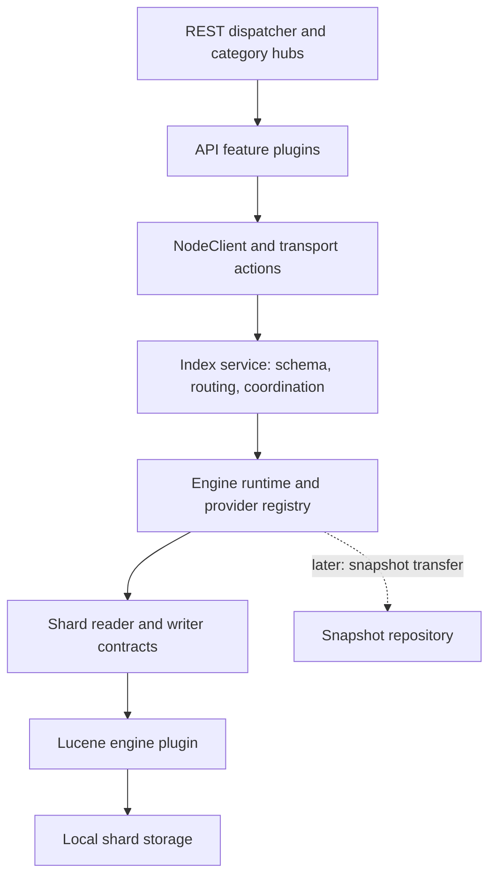
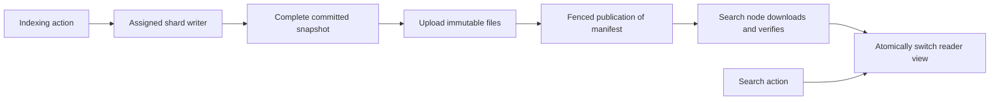

# Pluggable Lucene engine architecture

Status: phases 1–3 implemented as an experimental local search service. Index actions and separate management, indexing, and search REST adapters now use the pluggable engine. Remote snapshots and removal of Lucene from the server classpath remain planned.

## Decision

Introduce a shard-level engine contract with separate reader and writer interfaces. Implement it in a Lucene plugin. Keep index metadata, shard placement, routing, transport actions, and REST handling outside the engine implementation.

The first implementation runs locally with one writer per shard and committed readers on the same node. It acknowledges writes after a durable local commit. A later deployment can publish immutable snapshots for independent search nodes without changing the REST API or making the coordinator understand Lucene files.

The long-term target is a server that can start without Lucene. Existing Lucene utility dependencies remain during the first implementation and are removed in a separate migration.

## Implemented local profile

- `libs/engine-api` contains JDK-only contracts. Its `checkApiDependencies` task rejects production dependencies.
- `modules/engine` discovers providers, binds one `EngineService`, and owns the lifecycle of shard readers and writers. It packages the API JAR once.
- `modules/lucene-engine` extends `engine` and supplies provider `lucene`. It uses the centrally versioned Lucene already on the server classpath, without bundling duplicate Lucene or API classes.
- `libs/index-api` defines versioned, bounded action requests and responses. `modules/index-service` packages this API once, owns the durable index catalog, and registers seven backend-independent transport actions.
- `modules/index-management-api`, `modules/index-indexing-api`, and `modules/index-search-api` each extend index-service and their respective REST category hub. These adapters parse JSON into typed actions and never access Lucene objects.
- Supported operations are full document replacement, delete, visible get, match-all, exact term, analyzed text match, and Boolean queries. Fields are single-valued strings with explicit `KEYWORD` or `TEXT` mappings; text uses `StandardAnalyzer`.
- Every successful batch is committed before acknowledgement. The entire batch is validated before application. A failure after application begins is `WRITE_OUTCOME_UNKNOWN` and disables the writer until close/reopen. Closing a writer rolls back any unacknowledged pending changes.
- Readers start from a committed snapshot and advance only through explicit `refresh`. Get and search share these visibility rules. There is no automatic refresh or realtime get. Each operation releases its pinned view and returns owned document values.
- Checkpoints persist shard identity, history UUID, and sequence. Writes are serialized per writer, but concurrent submissions have no guaranteed invocation order. Callers chain completion stages when ordering matters.
- Shards live under the first configured data path at `engines/<index UUID>/<shard ID>`. A durable `engine.id` marker prevents reopening the same shard with a different provider. Lucene commit metadata also validates shard, schema version, schema fields, and format.

The asynchronous `EngineService` is available through explicit Guice binding after plugin components are created and accepts operations after node lifecycle start. Index-service consumes it through injection and opens recovered shards lazily; concurrent first requests share one open operation. Node lifecycle owns index-service, and the engine runtime remains the sole owner of its shard resources.

Example for a consumer plugin extending `engine` and implementing `EngineExtension`:

```java
ShardId shard = new ShardId(indexUuid, 0);
Schema schema = new Schema(1, Map.of("title", Schema.FieldType.TEXT));
EngineDocument document = new EngineDocument("1", Map.of("title", "Hello search"), sourceBytes);

engine.openShard("lucene", shard, schema, EngineService.Mode.READ_WRITE, OperationContext.standard())
    .thenCompose(ignored -> engine.write(shard, List.of(new Mutation.Put(document)), OperationContext.standard()))
    .thenCompose(written -> engine.refresh(shard, OperationContext.standard()))
    .thenCompose(visible -> engine.search(shard, new SearchQuery.Match("title", "hello"), 10, OperationContext.standard()));
```

Consume the final stage and handle failures in the action layer. A cancelled future does not prove that a mutation was rolled back. Deadlines and cancellation are cooperative; filesystem sync/open can exceed a deadline. Successful commits retain their known durable outcome even when cancellation arrives during commit. A failed writer requires explicit close/reopen and outcome reconciliation before retry.

Settings are node-scoped:

| Setting | Default | Bounds / meaning |
| --- | --- | --- |
| `engine.roles` | `[reader, writer]` | Allowed local execution capabilities, independent of REST categories |
| `engine.workers` | `2` | 1–32 workers shared by engine operations |
| `engine.queue_capacity` | `64` | 1–8192 queued operations |
| `engine.max_open_shards` | `16` | 1–1024 shard handles |
| `engine.max_pending_bytes` | `67108864` | 1 MiB–1 GiB of estimated queued/running request memory |
| `index_service.max_indices` | `16` | 1–1024 persisted local indices; shard admission also requires an available engine handle |

Additional fixed limits: 128 schema/document fields; 1 MiB document payload; 1024 operations and 4 MiB estimated bytes per batch; 128 query nodes, depth 16, and 512 expanded clauses; 1000 hits and 8 MiB estimated response bytes; operation timeout up to 30 seconds. These account for bounded request/result values, not total JVM memory or index size. Lucene uses a 16 MiB indexing buffer per writer; disk capacity, cache accounting, and retained-snapshot quotas need further work before broader workloads.

Shutdown stops admission, drains accepted work, and closes every shard once. After 30 seconds it cancels queued work and interrupts workers, then waits one further second. If a worker is still active, close reports failure and its termination hook retains responsibility for eventual resource cleanup.

Verification includes API dependency isolation, registry/role/admission/lifecycle tests, direct Lucene inspection of committed files, restart recovery, injected commit and catalog-publication failures, pinned views, concurrent read/write execution, independent wire fixtures, and REST-to-action integration tests. A real node loads the packaged modules, serves the workflow over Netty HTTP, is killed with SIGKILL after acknowledgement, and recovers the same index UUID and committed documents on restart. It also verifies category filtering and graceful shutdown. This establishes process-crash recovery; storage must still honor sync for power-loss durability.

## Local REST profile

Every index has one local shard, an immutable schema, a persistent UUID, and an explicit engine ID (default `lucene`). There is no automatic index creation. All data operations resolve the durable name-to-UUID catalog before entering the engine runtime.

| Category / module | Method and path | Operation |
| --- | --- | --- |
| Management / `index-management-api` | `PUT /{index}` | Create with explicit `mappings.properties` |
| Management / `index-management-api` | `GET /{index}` | Read metadata |
| Management / `index-management-api` | `POST /{index}/_refresh` | Advance the local reader to a committed snapshot |
| Indexing / `index-indexing-api` | `PUT /{index}/_doc/{id}` | Replace the document and durably commit |
| Indexing / `index-indexing-api` | `DELETE /{index}/_doc/{id}` | Delete by ID and durably commit |
| Search / `index-search-api` | `GET /{index}/_doc/{id}` | Get from the visible snapshot; absent documents return 404 |
| Search / `index-search-api` | `GET` or `POST /{index}/_search` | Search the visible snapshot |

With the default local roles and all three categories enabled:

```sh
curl -sS -X PUT localhost:9200/books -H 'Content-Type: application/json' -d '{
  "mappings": {"properties": {
    "title": {"type": "text"},
    "tag": {"type": "keyword"}
  }}
}'
curl -sS -X PUT localhost:9200/books/_doc/1 -H 'Content-Type: application/json' \
  -d '{"title":"Hello search","tag":"example"}'
curl -sS -X POST localhost:9200/books/_refresh
curl -sS -X POST localhost:9200/books/_search -H 'Content-Type: application/json' \
  -d '{"query":{"match":{"title":"hello"}},"size":10}'
curl -sS localhost:9200/books/_doc/1
```

The supported JSON query operators are `match_all`, single-field `term` and `match`, and `bool` with `must`, `should`, `must_not`, and integer `minimum_should_match`. Search accepts `query` and `size` (1–1000, default 10) in the body. An empty body means match-all. Unsupported options and query parameters fail explicitly. Documents contain only single-valued string fields declared in the schema; returned `_source` is the normalized field map. Index names match `[a-z0-9][a-z0-9._-]{0,127}`.

Create/search bodies are limited to 64 KiB, document bodies to 1 MiB, and parsed JSON to 8192 values and depth 24. The engine document limit also counts the owned source and normalized field values together, so a body below the HTTP limit can still exceed the document limit. Requests have bounded binary encodings, task cancellation, and preserved listener thread context. Engine work uses the bounded engine pool; catalog creation uses a separate single worker with a queue of 64.

Successful mutations return `acknowledged: true` and a durable checkpoint. They do not distinguish created/updated or deleted/not-found, and do not imply search visibility. Refresh must be explicit; reopening after restart starts a reader at the latest durable commit. These routes implement a small OpenSearch-shaped API with limited response and DSL compatibility.

Catalog entries live under the first configured data path at `index-catalog/<UUID>.meta`. Creation opens and commits the shard before writing, syncing, atomically publishing, and directory-syncing its metadata. A writer holds an exclusive catalog lock. Startup validates the bounded metadata files and rejects corruption or duplicate identities. An uncertain catalog publication stops further creates until restart and reconciliation; it never silently retries with another UUID. A failed engine writer also requires restart through this API, which does not yet expose shard close/reopen.

`rest.api.categories: [search]` exposes only search handlers. Disabled routes return 404 when no enabled handler matches their path. A shared document path still supports GET, so PUT on that path returns 405 when indexing is disabled. Category filtering does not grant permissions or assign execution roles. `engine.roles` limits local execution even for internal action calls; it does not create distributed routing. Reader-only nodes load the catalog at startup and cannot create indices or write documents.

This profile has no index deletion, bulk API, aliases, schema changes, multi-shard coordination, independent remote search nodes, or automatic failover. Those require additional contracts and recovery tests.

The remaining sections describe the target architecture, including contracts and modules beyond this local profile.

## Current foundations and constraints

- `modules/rest` supplies one HTTP dispatcher; the search, indexing, and management API modules are category extension hubs. They do not implement a search engine.
- `rest.api.categories` controls route exposure. Disabled routes are absent and return 404 when no enabled route matches the path. It is independent of execution placement and caller authorization.
- Plugins already support extension dependencies, Guice modules, lifecycle services, and transport action registration.
- `Node` constructs plugin components before creating the injector and before initializing `NodeClient`. Engine factories must not open shards or execute client actions during plugin discovery or component construction.
- `createComponents` currently registers lifecycle objects but does not bind arbitrary returned services into Guice, despite the broad wording of the Plugin API comment. Shared engine services need explicit bindings through `createGuiceModules`.
- `PluginsService` loads extension dependencies before their dependents. Its Lucene codec SPI reload currently runs in the core loader.
- Core bootstrap, transport, bytes, and memory utilities use Lucene classes. OpenSearch dependencies also need a dependency and public-signature audit before Lucene can leave the server runtime classpath.
- The engine and index layers live in the projects listed above; there is no `libs/generic-engine` project.

## Module boundaries

| Module | Owns | Must not own |
| --- | --- | --- |
| `server` | Bootstrap, generic plugin lifecycle, HTTP/transport infrastructure, action dispatch, shared task services | Engine selection, shard storage, query planning, Lucene classes in the final architecture |
| `libs/engine-api` | Engine descriptors and factories, shard reader/writer contracts, normalized documents and queries, errors, checkpoints, snapshot leases, host resource contracts | REST, transport serialization, Guice, Lucene, cloud SDKs |
| `modules/engine` | Provider registry, shard engine instances, lifecycle, execution admission, host resource adapters | OpenSearch JSON parsing, Lucene-specific algorithms |
| `modules/lucene-engine` | Document-to-Lucene translation, analyzers, query compilation, writers, readers, directories, codecs, commit/recovery behavior | HTTP routes, index-name resolution, distributed placement, authorization policy |
| `libs/index-api` | Index metadata, operation actions, bounded request/response wire types, consumer extension marker | REST route registration, backend implementation classes |
| `modules/index-service` | Index catalog and schema versions, shard routing, coordination, action execution, per-index backend selection | Lucene readers, writers, queries, or file formats |
| Search/indexing/management API feature plugins | Request parsing, response formatting, contribution to one existing API hub | Engine construction or direct access to Lucene |
| Future snapshot repository plugin | Immutable blob storage and retrieval, snapshot metadata persistence, integration with fenced publication and retention | Parsing Lucene segments, choosing query execution plans |

The engine API is a plain library packaged once by `modules/engine`. It does not become a server dependency. Both `libs/engine-api` and `libs/index-api` are explicitly registered in `settings.gradle`; automatic discovery only covers modules and plugins.

The index-service SPI depends on the engine API and compiles against server action types. The engine API itself remains independent of server types. This keeps transport compatibility concerns out of backend contracts.



Arrows describe request flow. Compile-time dependencies point toward shared contracts: API and index-service code never import the Lucene implementation.

## Plugin registration and class loading

Use the existing plugin extension mechanism, rather than a second discovery system.

1. `EnginePlugin` in `modules/engine` is extensible and exports `engine-api` in its bundle.
2. `LuceneEnginePlugin` declares `extendedPlugins = ['engine']` and implements a small `EngineExtension` contract. It contributes a provider factory with ID `lucene`.
3. `IndexServicePlugin` also extends `engine`, implements `EngineExtension` with no provider contribution, and consumes the shared registry. An extension can be a provider, a consumer, or both.
4. Index-service exports `index-api`. API feature plugins extend index-service and exactly one category hub, for example `['index-service', 'search-api']`, and implement `IndexExtension`. Index-service accepts these extensions without registering their REST handlers a second time.
5. The engine module binds the registry and runtime explicitly. Index-service binds its coordination services explicitly. Actions receive those interfaces through injection; no global service locator or calls between concrete plugin classes.

The runtime validates provider IDs, API compatibility, and supported capabilities before opening shards. Duplicate provider IDs are startup errors; multiple distinct provider IDs may coexist. Provider selection is explicit and persisted in index metadata. The initial distribution defaults newly created indices to `lucene`, while an existing index always uses its recorded backend.

If a node is assigned a shard whose provider is absent or incompatible, that shard remains unavailable with a precise diagnostic. Startup fails for an invalid local configuration; allocation fails for an unsupported incoming assignment. Neither case silently substitutes another engine. A node with no engine assignments can run without a provider.

Plugins load at startup and remain loaded until node shutdown. Hot engine unload and multiple Lucene versions in one JVM are outside the initial design. Initially the Lucene engine uses the same centrally managed Lucene version as existing core utilities; it must not bundle duplicate Lucene classes while those classes remain on the parent classpath.

## Engine contracts

The unit of ownership is a shard identified by index UUID and shard ID. Names and aliases are resolved by index-service before calling the runtime.

The following is a contract sketch, not an implementation-ready Java API:

```java
interface EngineProvider {
    EngineDescriptor descriptor();
    ShardWriter openWriter(ShardSpec shard, WriterContext context);
    ShardReader openReader(ShardSpec shard, ReaderContext context);
}

interface ShardWriter extends AutoCloseable {
    WriteBatchResult write(WriteBatch batch, OperationContext context);
    SnapshotLease acquireSnapshot(Checkpoint minimum, OperationContext context);
}

interface ShardReader extends AutoCloseable {
    ReadView acquireView(ReadRequirement requirement, OperationContext context);
    RefreshResult refresh(SnapshotSource source, OperationContext context);
}

interface ReadView extends AutoCloseable {
    SearchResult search(SearchPlan plan, OperationContext context);
    GetResult get(DocumentId id, OperationContext context);
    Checkpoint checkpoint();
}
```

Contract rules:

- Calls may block and execute only on bounded engine worker pools, never on a Netty/event-loop thread. Public actions remain asynchronous. Provider implementations must not create unbounded work queues.
- `ShardWriter.write` returns successful item outcomes only after the configured durability boundary. The initial profile is local durable commit. Failures distinguish rejected input, known failure before application, and unknown write outcome.
- `ShardReader` has no mutation methods. A reader node never opens an `IndexWriter`. A colocated deployment shares a directory resource safely, with one owner responsible for closing it after both reader and writer handles close.
- Each `ReadView` pins a consistent snapshot for the complete operation. It must be released on success, failure, cancellation, and response-construction failure. Results contain owned values, not references into a released view.
- `OperationContext` carries a deadline, cancellation token, tracing context, and explicit resource budget. Authentication and authorization finish before execution; backend code does not infer identity from thread-local headers.
- Cancellation after a mutation has begun does not prove the write was rolled back. The response contract must preserve an unknown outcome when appropriate.
- Engine errors use stable engine-neutral categories. API/action layers map them into wire and HTTP errors. Lucene exceptions and objects do not cross the contract.
- Factories receive narrow host services: assigned storage roots, bounded executors, memory accounting, metrics, and clocks. They do not receive `NodeClient`, the injector, or unrestricted access to other plugins.

A `SnapshotLease` pins a descriptor and its readable files until close. Its `SnapshotSource` supports bounded file reads without exposing a Lucene directory. A successful reader refresh acquires its own file references before the transfer lease is released. Local readers can reuse pinned local files; remote readers materialize and verify a snapshot first.

A provider descriptor advertises supported field types, query operators, snapshot format versions, and optional capabilities. Index-service validates the selected provider against the schema and request plan. Unsupported features produce explicit errors; there is no generic success-shaped fallback.

## Documents, schema, and query planning

Index-service owns logical schemas and their versions. It validates requests and produces a normalized plan against an immutable schema version. Lucene-engine compiles that plan into backend objects.

The initial contract should include document ID, typed field values, source bytes, schema version, and supported preconditions. Start with full document replacement, delete by ID, retrieval from a visible snapshot, match-all, exact-term, text-match, and bounded Boolean combinations. Add sorting and pagination only with explicit stable ordering and snapshot rules. A vector or aggregation capability can be added when its request/result semantics are defined.

Keep source and request buffers owned or explicitly leased across asynchronous boundaries. The first implementation may copy bounded payloads for clear ownership. Never expose `BytesRef`, `Query`, `Document`, `ScoreDoc`, `Directory`, or an analyzer instance in the SPI.

Do not put raw OpenSearch JSON in a nominally generic `execute` method. API adapters parse the supported DSL; a backend receives typed operations. Engine-specific extensions may use a versioned namespace, but must be declared in capabilities and validated before shard execution.

Changing the engine type of an existing index requires creating a new index and reindexing. Schema changes that alter interpretation of existing data likewise require an explicit migration or reindex; hot provider replacement cannot reinterpret persisted files.

## Durability, visibility, and ordering

Durability and search visibility are separate concepts in the public contract.

| Milestone | Meaning |
| --- | --- |
| Accepted | Request passed validation/admission; no durable success is implied |
| Durable | The configured storage profile can recover the acknowledged mutation |
| Visible | A particular reader view contains that mutation or a later state in the same history |
| Published | A complete snapshot is available for independent readers through a repository |

For the first local implementation:

1. Index-service resolves an index, schema version, and shard. It validates input before entering that shard's ordered mutation executor.
2. Lucene-engine serializes accepted mutations per shard, assigns engine-owned sequence numbers, and applies the batch.
3. It persists the durable checkpoint in commit metadata and commits the batch. Grouping bounded batches behind one commit barrier is allowed.
4. It acknowledges only mutations covered by that commit. Lucene flush alone is insufficient for this contract; `IndexWriter.commit()` synchronizes the referenced index files. This relies on the storage honoring sync operations. [Lucene IndexWriter](https://lucene.apache.org/core/10_4_0/core/org/apache/lucene/index/IndexWriter.html)
5. Readers periodically refresh from committed snapshots. Use a directory/commit-based reader initially so queries cannot observe a later uncommitted batch.
6. A request that asks to wait for visibility waits until the target reader reaches its returned checkpoint, subject to a deadline. An ordinary search reads the current visible snapshot.

This deliberately pays a commit cost in the first implementation. A custom write-ahead log is a later optimization, with its own crash-recovery proof; it is not a prerequisite for defining the plugin boundary.

A bulk request is not a transaction across documents or shards. Item validation failures are reported independently. An I/O failure after application can leave an ambiguous outcome; the affected writer enters a failed state and must recover before serving more mutations. Do not automatically retry non-idempotent operations. Initially omit script updates and increments; document replacement by a stable ID, with concurrency preconditions where needed, gives callers a practical retry path without promising exactly-once execution.

Checkpoints contain index UUID, shard ID, history UUID, and an engine-owned sequence number. Persist the sequence with the committed state. Restore into a new history identity when history continuity cannot be guaranteed. Do not expose Lucene's writer sequence numbers as durable tokens: Lucene documents them as transient and specific to one writer instance. [Lucene sequence numbers](https://lucene.apache.org/core/10_4_0/core/org/apache/lucene/index/IndexWriter.html)

A multi-shard write yields per-shard checkpoints. The coordinator carries a vector of these checkpoints when a subsequent read requests that visibility; there is no fabricated global sequence number or implicit cross-shard snapshot.

Get-by-ID initially has the same visible-snapshot semantics as search. Supporting OpenSearch-style realtime get would require a separate writer/log lookup path and is an explicit later feature.

## Independent indexing and search nodes

API exposure, execution placement, and authorization are three separate decisions:

| Decision | Owner | Example |
| --- | --- | --- |
| Which HTTP routes exist | REST/category hubs | `rest.api.categories: [search]` |
| Which node may execute a shard operation | Allocation and engine runtime | Writer assignment versus reader assignment |
| Which operations a caller may perform | Action authorization layer | Read permission for a particular index |

A search-facing coordinator may route to a remote reader. A node accepting indexing requests may forward to the assigned writer. Management APIs manage index metadata and allocation through the control plane; they do not imply ownership of local shard files.

Enforce execution capability and assignment at the internal action/runtime boundary as well as route exposure. An internal transport request cannot create a writer on a reader-only node. Permission failures on available APIs remain 403; unavailable HTTP routes remain 404.

A later remote deployment follows this flow:



A snapshot descriptor records backend ID, format/version requirements, schema and analyzer identity, shard/history identity, checkpoint, writer epoch, and an opaque snapshot ID. Its complete file manifest includes names, sizes, and checksums. The repository transfers opaque bytes; Lucene-engine interprets the contents.

The writer pins the committed files until transfer finishes. Lucene snapshot deletion policies can protect a commit during this interval. A process-local pin is not sufficient to preserve work across restart: either use a persistent pin or abandon and rebuild an incomplete publication during recovery. [Lucene SnapshotDeletionPolicy](https://lucene.apache.org/core/10_4_0/core/org/apache/lucene/index/SnapshotDeletionPolicy.html)

Publish only after every referenced file is uploaded and verified. Readers never infer a committed index by listing an object-store prefix. A reader opens the exact manifest snapshot, validates compatibility and checksums, warms it, then atomically swaps the visible view. Existing queries retain their previous view until release. Lucene provides reader acquisition/release management for this ownership pattern. [Lucene SearcherManager](https://lucene.apache.org/core/10_4_0/core/org/apache/lucene/search/SearcherManager.html)

Retain snapshots while referenced by active readers, transfers, recovery, or point-in-time leases. Garbage collection uses explicit references and a grace period; deleting the old manifest immediately after publishing a replacement is unsafe.

Before enabling automatic writer failover, provide an authoritative allocation epoch and enforce fencing at the durable publication/acknowledgement boundary. Local directory locks do not fence writers on different machines. An old writer must be unable to publish after losing ownership. Select and test the coordinator/storage conditional-update primitive before shipping this mode.

The initial remote durability profile acknowledges writes only after successful fenced publication of the committed snapshot. A replicated write-ahead log can later provide earlier durable acknowledgements. Local-disk acknowledgement alone cannot promise survival of writer-node loss.

Search freshness follows publication and reader refresh. A caller can request a minimum checkpoint and either wait, route to a suitable reader, or receive a timeout/unavailable result. A token from a different index or history fails explicitly instead of waiting for an unrelated sequence number. The system must never silently claim the requested visibility when serving an older snapshot.

## Lifecycle and failure handling

Use an explicit shard state machine: `CLOSED -> OPENING -> RECOVERING -> READY -> DRAINING -> CLOSED`, with failures moving to `FAILED`. Readiness is per capability: a reader with an older valid snapshot can remain available while a new snapshot download fails; a new reader with no valid snapshot cannot.

Construction collects and validates descriptors only. Once core services and the injector exist, initialize the engine registry and host adapters. Recover assigned shards before accepting their operations. Dependency readiness must be explicit; do not rely on arbitrary plugin iteration order.

The engine runtime is the sole owner of opened shard engines and closes them. Providers contribute factories, not independently lifecycle-registered copies of the same engine. Plugin shutdown must not close engine instances a second time.

On shutdown: stop admitting operations, drain bounded in-flight work, release reader/snapshot leases, close readers and writers, then directories and host adapters. Keep host executors alive until engine shutdown completes. Failed opens close every successfully allocated resource in reverse order while retaining the original failure.

Expose provider/version, shard state, queue depth, admission rejections, durable/visible/published checkpoints, refresh/publication lag, active reader leases, disk/cache use, and commit latency. Bound query complexity, result size, batch size, concurrent views, and retained snapshots before opening the API to untrusted clients.

## Removing Lucene from the core

Do this after the engine boundary is functioning:

1. Inventory direct imports and dependency paths, including public signatures in OpenSearch artifacts. Establish a baseline of the server runtime classpath.
2. Replace utility uses in bytes/serialization, memory accounting, platform constants, collections, and automata with core-owned or suitable non-Lucene abstractions. Preserve wire encodings with compatibility fixtures.
3. Move Lucene version validation into the provider. Server/product version and engine/on-disk version become separate compatibility checks.
4. Move codec SPI registration out of `PluginsService`. Add a generic extension-loading hook only if providers require it; the server must not invoke Lucene static registries. Register required codecs before opening existing indices.
5. Package Lucene dependencies exclusively with the engine plugin after parent-classpath dependencies are eliminated. Keep them centrally versioned and exclude duplicate API classes from provider bundles.
6. Verify a distribution containing HTTP/REST and metadata functionality can start without the Lucene engine JARs. Add build checks preventing Lucene imports/dependencies from returning to the server and engine API.

Until these steps complete, describe the result as a pluggable Lucene engine with a shared Lucene runtime dependency. The ability to omit Lucene from the process is a separate completion criterion.

## Delivery sequence and acceptance criteria

| Phase | Deliverable | Required evidence |
| --- | --- | --- |
| 1 | Engine API, module/classloader wiring, provider registry, lifecycle and resource ownership | API compiles without Lucene/server; duplicate/missing provider diagnostics; real bundle loading; failed-open cleanup |
| 2 | Local Lucene backend and minimal schema/query model | Write, restart, and search; acknowledged-write recovery; concurrent readers; no uncommitted visibility; reader/writer cleanup |
| 3 | Index-service actions and three API adapters | Existing category/404 behavior preserved; backend-neutral API/transport tests; execution capability checks; bounded admission |
| 4 | Snapshot publication and independent search nodes | Incomplete uploads stay invisible; stale-writer fencing; reader refresh atomicity; restart-safe retention; checksum failures; freshness waits |
| 5 | Remove core Lucene dependencies | Server runtime dependency audit; unchanged wire fixtures; startup without Lucene jars; provider-owned compatibility checks |

Crash/recovery, concurrency, and compatibility checks are essential for engine work. Prefer independent persisted fixtures and process-level failure injection over encoder/decoder roundtrips. Phases 1–3 are implemented; phase 4 needs the repository, publication, and fencing design before independent search nodes can be enabled.

Default scope for phases 1–3: local disk, one writer per shard, committed reads, durable batch acknowledgement, minimal text search, and no automatic distributed failover. Full OpenSearch DSL compatibility, vector search, aggregations, scripting, realtime get, point-in-time pagination, and remote durability each need explicit follow-up contracts.
